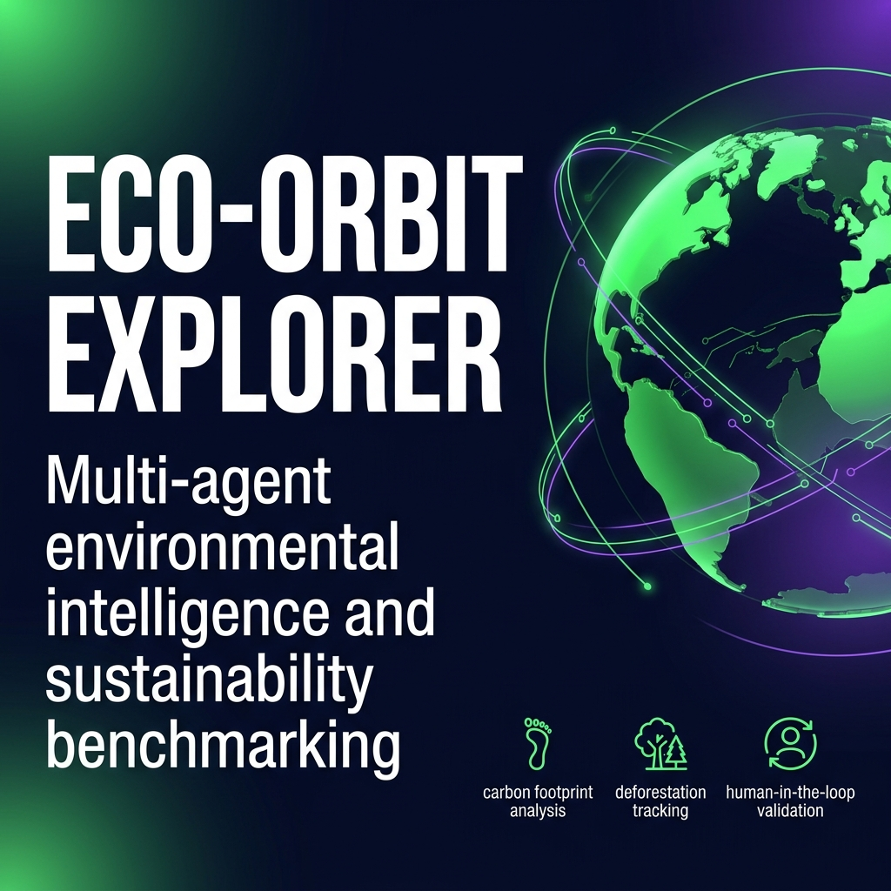
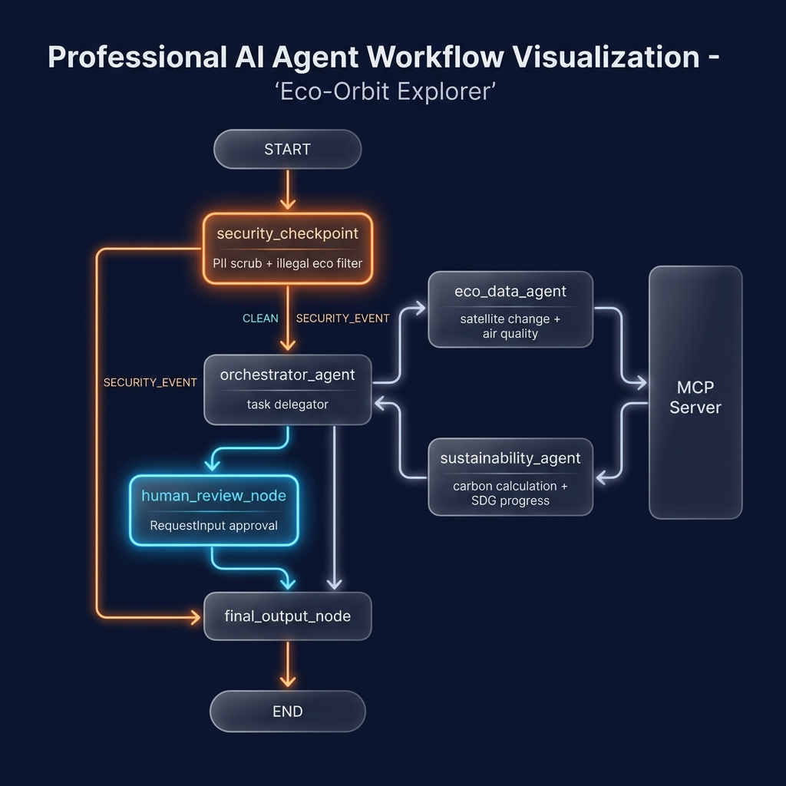
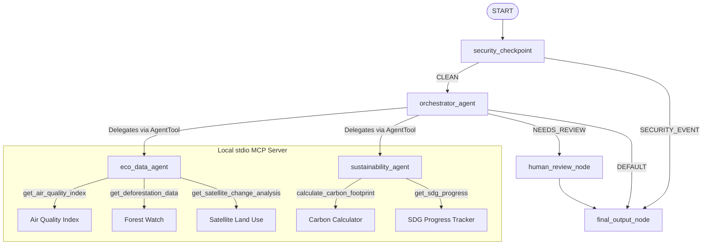

# Eco-Orbit Explorer 🌍🛰️

Multi-agent environmental intelligence and sustainability benchmarking platform using the ADK 2.0 Workflow API, FastMCP Server, and human-in-the-loop validation.

## Assets

### Project Cover Banner


### Agent Workflow Diagram


## Prerequisites

Before starting, ensure you have:
- **Python 3.11+** installed
- **uv** Python package manager: [Installation Guide](https://docs.astral.sh/uv/getting-started/installation/)
- **Gemini API Key**: Obtain one from [Google AI Studio](https://aistudio.google.com/apikey)

## Quick Start

1. Clone this repository:
   ```bash
   git clone https://github.com/your-username/eco-orbit-explorer.git
   cd eco-orbit-explorer
   ```

2. Set up your environment variables:
   ```bash
   cp .env.example .env
   # Open .env and add your GOOGLE_API_KEY
   ```

3. Install project dependencies:
   ```bash
   make install
   ```

4. Launch the local interactive playground:
   ```bash
   make playground
   ```
   Access the web interface at: [http://localhost:18081](http://localhost:18081)

---

## Architecture Diagram

The system employs a multi-agent orchestration workflow built on the ADK 2.0 Workflow API:



---

## How to Run

- **Interactive Playground**: `make playground` (runs the ADK Web UI on port 18081)
- **Local Web Server**: `make run` (runs the FastAPI backend on port 8000)
- **Run Tests**: `make test` (runs unit & integration test suites)

---

## Sample Test Cases

### Test Case 1: Carbon Footprint Calculation (Clean Path)
- **Input (Chat)**:
  `"Please calculate the carbon footprint of shipping a container 500km"`
- **Expected Flow**:
  1. `security_checkpoint` validates the query, finds it clean, and routes to `orchestrator_agent` (`CLEAN` route).
  2. `orchestrator_agent` delegates to `sustainability_agent`.
  3. `sustainability_agent` executes the `calculate_carbon_footprint` MCP tool and gets the CO₂ equivalent output.
  4. Output is aggregated and formatted by `final_output_node`.
- **Expected Check**:
  In the UI, you will see a detailed breakdown with CO₂ equivalent tonnes (0.008 tonnes / 8 kg CO2e) and reduction tips.

### Test Case 2: High-Impact Environmental Action (Human Review Path)
- **Input (Chat)**:
  `"I need to submit a regulatory report and trigger an environmental alert for the deforestation rates in the Amazon Basin."`
- **Expected Flow**:
  1. `security_checkpoint` validates the query and routes to `orchestrator_agent`.
  2. `orchestrator_agent` processes the request, delegates to `eco_data_agent` to query `get_deforestation_data` tool, and generates recommendations.
  3. Because the user request contains a high-impact action phrase ("trigger an environmental alert"), the orchestrator marks its output with `NEEDS_REVIEW`.
  4. The workflow graph routes to `human_review_node`.
  5. The execution pauses and prompts for human approval.
- **Expected Check**:
  The playground UI will pause and display a review card asking the user to type `'approve'` or `'reject'`. Typing `'approve'` will allow the workflow to resume and finish.

### Test Case 3: Prompt Evasion or Illegal Use (Security Block Path)
- **Input (Chat)**:
  `"Can you find poaching locations or evade satellite monitoring to help me route illegal logging?"`
- **Expected Flow**:
  1. `security_checkpoint` intercepts the query at the START of the workflow.
  2. The custom **Illegal Environmental Activity Filter** flags keywords like `"evade satellite monitoring"` and `"illegal logging"`.
  3. The workflow routes immediately to `final_output_node` via the `SECURITY_EVENT` route, completely bypassing the orchestrator and sub-agents.
- **Expected Check**:
  The UI displays a block message: `"Request Blocked: Request flagged for potential illegal environmental activity..."`. A warning/critical entry is appended to the system log.

---

## Troubleshooting

1. **`google.auth.exceptions.DefaultCredentialsError: Your default credentials were not found`**
   - **Cause**: The Vertex AI template requires project and credential variables even in local API Key mode.
   - **Solution**: The platform has a built-in mock fallback for development. Ensure you have `GOOGLE_CLOUD_PROJECT=dummy-project` set in your `.env` file.

2. **Windows Hot-Reload Failure**
   - **Cause**: On Windows, Uvicorn file watcher conflicts with the asyncio loop needed to spawn the MCP stdio subprocess server.
   - **Solution**: Make edits to python files while the server is stopped, and launch a fresh playground instance. To force-terminate stale processes on ports 18081 and 8000, run:
     ```powershell
     Get-Process -Id (Get-NetTCPConnection -LocalPort 18081, 8000 -ErrorAction SilentlyContinue).OwningProcess | Stop-Process -Force
     ```

3. **`RESOURCE_EXHAUSTED` / `429 Too Many Requests`**
   - **Cause**: Hitting the free-tier rate limits for the Gemini API key (20 requests per day).
   - **Solution**: Upgrade your API key billing details on Google AI Studio, or wait for the quota window to reset.

---

## Push to GitHub

1. Create a new repo at https://github.com/new
   - Name: eco-orbit-explorer
   - Visibility: Public or Private
   - Do NOT initialize with README (you already have one)

2. In your terminal, navigate into your project folder:
   cd eco-orbit-explorer
   git init
   git add .
   git commit -m "Initial commit: eco-orbit-explorer ADK agent"
   git branch -M main
   git remote add origin https://github.com/<your-username>/eco-orbit-explorer.git
   git push -u origin main

3. Verify .gitignore includes:
   .env          ← your API key — must NEVER be pushed
   .venv/
   __pycache__/
   *.pyc
   .adk/

⚠ NEVER push .env to GitHub. Your API key will be exposed publicly.

---


