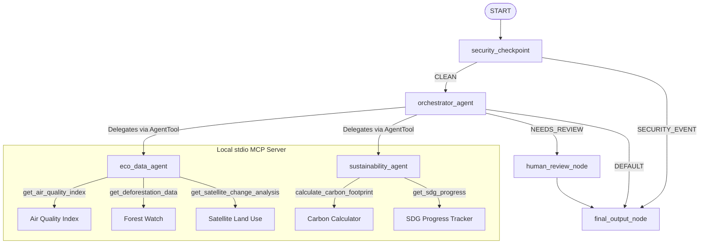

# Submission Write-Up — Eco-Orbit Explorer 🌍🛰️

## Problem Statement
Climate change, deforestation, and industrial pollution require rapid analysis and data consolidation. Environmental researchers, corporate compliance officers, and conservationists must traverse multiple sources of unstructured data, calculate Scope 1/2/3 carbon emissions, monitor satellite anomalies, and match sustainability goals to UN Sustainable Development Goals (SDGs). 

**Eco-Orbit Explorer** solves this by providing a unified, multi-agent conversational interface. It automates satellite data fetching, carbon calculations, and SDG tracking, while maintaining strict PII/injection security guards and human-in-the-loop validation for sensitive, high-impact environmental operations.

---

## Solution Architecture
The application runs as a secure, directed acyclic graph built on the **ADK 2.0 Workflow API**:

---

## Concepts Used (with File References)

1. **ADK Workflow**: Implemented in [`app/agent.py`](file:///c:/Users/acer/Documents/adk-workspace/eco-orbit-explorer/app/agent.py) via `Workflow`, `Edge`, and `@node` decorators. Manages the orchestration graph.
2. **LlmAgent**: Specialist agents (`eco_data_agent`, `sustainability_agent`, and `orchestrator_agent`) are constructed as separate `LlmAgent` instances in [`app/agent.py`](file:///c:/Users/acer/Documents/adk-workspace/eco-orbit-explorer/app/agent.py#L42-L176) to partition cognitive domains.
3. **AgentTool**: The `orchestrator_agent` uses `AgentTool` in [`app/agent.py`](file:///c:/Users/acer/Documents/adk-workspace/eco-orbit-explorer/app/agent.py#L170-L173) to delegate specialized sub-tasks dynamically to sub-agents.
4. **MCP Server**: Stdio Model Context Protocol (MCP) server implemented in [`app/mcp_server.py`](file:///c:/Users/acer/Documents/adk-workspace/eco-orbit-explorer/app/mcp_server.py) using `FastMCP`. Wired into the sub-agents in [`app/agent.py`](file:///c:/Users/acer/Documents/adk-workspace/eco-orbit-explorer/app/agent.py#L47-L56) using `McpToolset` and `StdioConnectionParams`.
5. **Security Checkpoint**: The `security_checkpoint` node in [`app/agent.py`](file:///c:/Users/acer/Documents/adk-workspace/eco-orbit-explorer/app/agent.py#L228-L327) acts as a gateway at the entry point of the graph.
6. **Agents CLI & Pluggable Auth**: Configured in [`agents-cli-manifest.yaml`](file:///c:/Users/acer/Documents/adk-workspace/eco-orbit-explorer/agents-cli-manifest.yaml) and integrated into the FastAPI backend [`app/fast_api_app.py`](file:///c:/Users/acer/Documents/adk-workspace/eco-orbit-explorer/app/fast_api_app.py) to manage deployment and authorization hooks.

---

## Security Design
The `security_checkpoint` node executes three critical checks:
- **PII Scrubbing**: Sanitizes sensitive fields using regex. In addition to standard emails, credit cards, and SSNs, it sanitizes precise GPS coordinates and industrial EPA permit IDs to prevent data leaks.
- **Prompt Injection Defense**: Scans input string for jailbreaks or instructions bypasses (e.g. `"ignore previous instructions"`). Injection immediately routes to a security terminal output.
- **Illegal Activity Filter (Domain Rule)**: Specific blocklist for illegal environmental acts (e.g. `"poaching locations"`, `"falsifying emissions"`). Prevents the agents from enabling wildlife crimes or greenwashing audits.
- **Structured JSON Audit Logs**: Every routing decision writes a structured JSON event to standard error/logs containing variables like `pii_detected`, `event_type`, and `severity` (INFO, WARNING, CRITICAL) for downstream ingestion (e.g. Google Cloud Logging).

---

## MCP Server Design
The FastMCP server exposes five analytical tools:
1. **`get_air_quality_index(location, include_pollutants)`**: Yields current AQI classification, health warnings, and particulate counts (PM2.5, PM10).
2. **`get_deforestation_data(region, year_start, year_end)`**: Returns yearly land clearing rates, net forest loss (in km² and football field equivalents), and trend predictions.
3. **`get_satellite_change_analysis(region, change_type)`**: Analyzes urbanization footprint, vegetation index (NDVI), or water body changes, outputting risk classifications.
4. **`calculate_carbon_footprint(activity_type, quantity, unit)`**: Calculates CO₂ equivalent values for transit (flight, car, train), diets (beef), or utilities (electricity, gas), benchmarking against standard carbon profiles.
5. **`get_sdg_progress(country, sdg_goals)`**: Reports scoring indices for UN SDGs 7, 13, 14, and 15, indicating whether the target country is on-track for 2030.

---

## Human-in-the-Loop (HITL) Flow
To prevent unauthorized or critical real-world actions, the system includes a `human_review_node`.
- **Trigger**: If the query involves submitting regulatory forms, filing pollution complaints, or setting satellite alerts, the `orchestrator_agent` includes the label `"NEEDS_REVIEW"` in its output.
- **Execution**: The workflow graph captures this and routes execution to the `human_review_node`, which yields a `RequestInput` object.
- **Pause & Resume**: The runtime pauses and prompts the user for action. Typing `"approve"` stores the verification in `ctx.state["human_approved"] = True` and completes the workflow execution.

---

## Demo Walkthrough
*Refer to the Sample Test Cases in the [README.md](file:///c:/Users/acer/Documents/adk-workspace/eco-orbit-explorer/README.md) for step-by-step executions of:*
1. **Clean Path**: Standard carbon footprint calculation.
2. **Human Review Path**: Submitting reports or triggering alerts.
3. **Security Block Path**: Evading satellite monitoring or poacher routing.

---

## Impact / Value Statement
Eco-Orbit Explorer automates data gathering, calculations, and policy compliance into one conversation.
- **Sustainability Coordinators** can calculate transit emissions and obtain instant reduction recommendations in seconds rather than looking up carbon indexes.
- **Conservation Agencies** can monitor deforestation trends and satellite anomalies without writing complex API scripts.
- **Enterprises** get a secure gateway that prevents corporate greenwashing audits or prompt injections, with human approval workflows for regulatory submissions.
